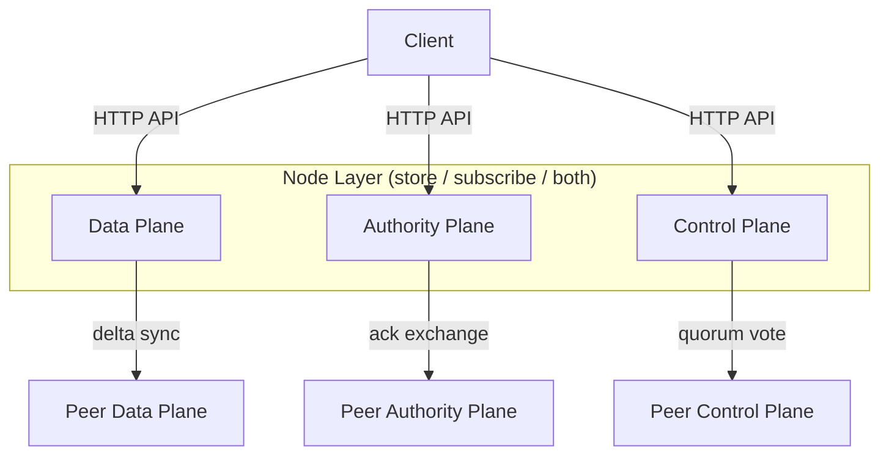
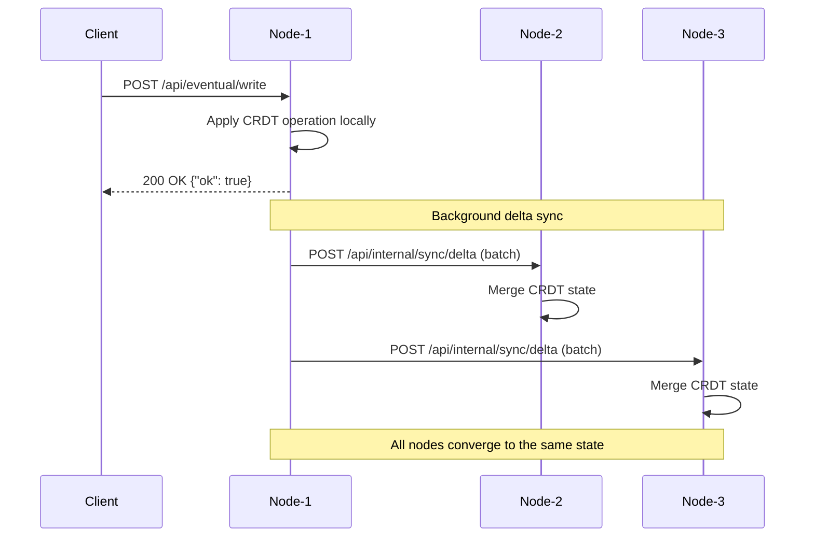
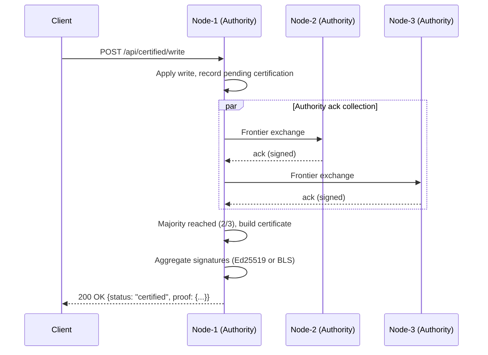
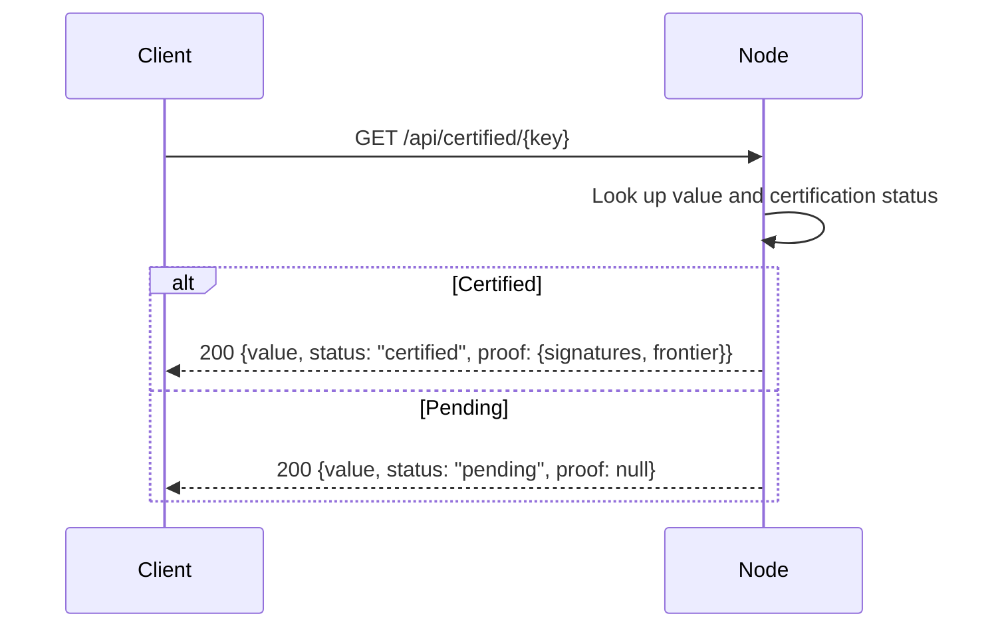
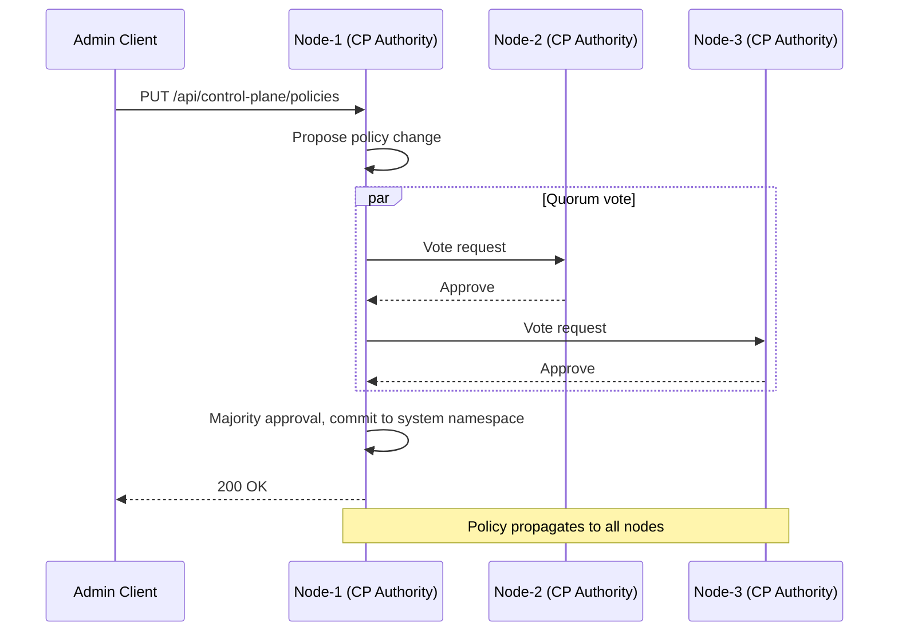
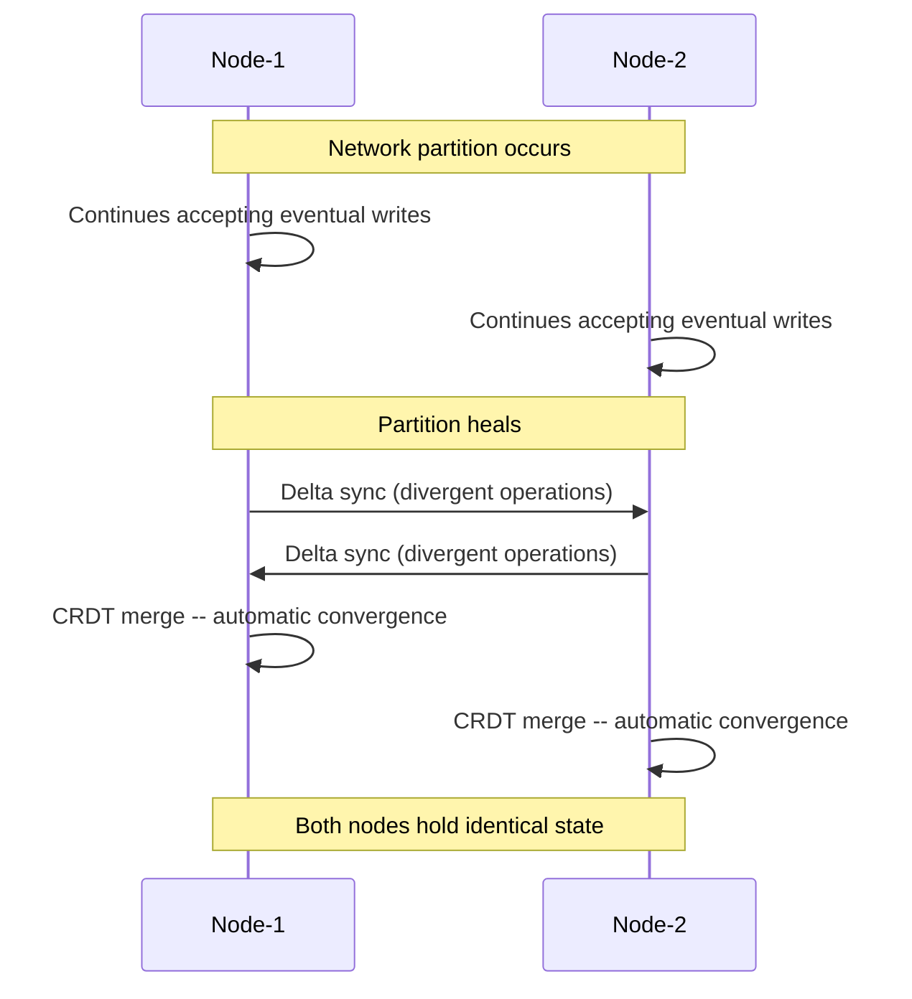

# AsteroidDB アーキテクチャ

本ドキュメントでは、AsteroidDB の内部アーキテクチャについて、コンポーネントの責務、
データフロー、主要な設計判断を説明します。

## コンポーネント概要

AsteroidDB は共通のノードレイヤを共有する 3 つのプレーンで構成されています:



### Data Plane

CRDT ベースのキーバリューデータの保存とレプリケーションを担当します。

| コンポーネント | 場所 | 役割 |
|--------------|------|------|
| CRDT Store | `src/store/` | バージョン管理付き KV ストレージ（PN-Counter, OR-Set, OR-Map, LWW-Register） |
| Delta Sync | `src/network/sync.rs` | バッチ処理と指数バックオフ付き anti-entropy レプリケーション |
| Compaction Engine | `src/compaction/engine.rs` | 圧縮可能な操作ログの削除（majority 確認済みのみ） |
| Adaptive Tuner | `src/compaction/tuner.rs` | 書き込みレートに基づく圧縮頻度の自動調整 |

### Authority Plane

キー範囲に割り当てられた Authority ノードの majority 確認を要求することで、
Certified 整合性を提供します。

| コンポーネント | 場所 | 役割 |
|--------------|------|------|
| Ack Frontier | `src/authority/ack_frontier.rs` | Authority ごとの確認済み更新を HLC ベースの frontier で追跡 |
| Frontier Signing | `src/authority/frontier_sig.rs` | frontier 報告への二重署名（報告全体への Ed25519 署名 + チェックポイント HLC への証明書署名）と registry ベースの受信検証 |
| Attestation Pool | `src/authority/attestation_pool.rs` | 検証済み attestation をスコープ × チェックポイント単位で収集し majority certificate を組み立て |
| Certificate | `src/authority/certificate.rs` | デュアルモード（Ed25519 / BLS）majority certificate の構築 |
| BLS Signatures | `src/authority/bls.rs` | `blst` クレート経由の BLS12-381 aggregate signatures と Proof-of-Possession（PoP、`POP_` DST での鍵所有証明） |
| Epoch Manager | `src/authority/certificate.rs` | 24 時間 epoch、7 epoch 猶予期間付き鍵ローテーション |

frontier 報告の署名対象は 1 秒単位に床丸めした「チェックポイント HLC」であり、
全 Authority が同一メッセージバイト列に署名する。これにより Ed25519 の
`MajorityCertificate`（単一メッセージ検証）と BLS `fast_aggregate_verify`
（同一メッセージ前提）の両方が成立する。certified read の
`ProofBundle.frontier_hlc` は certificate 付きの場合このチェックポイント値になる。

#### BLS Proof-of-Possession（rogue-key 攻撃対策）

`fast_aggregate_verify` は draft-irtf-cfrg-bls-signature の PoP スキームを前提とする
プリミティブであり、鍵所有証明を欠くと攻撃者が他者の公開鍵から逆算した rogue key
（`pk_rogue = pk_attacker − pk_victim`）を登録して集約検証を偽装できる。これを防ぐため、
BLS 鍵の登録時（`KeysetRegistry::register_bls_keys`——`KeysetEntry.bls_keys` への
**唯一の書き込み経路**。`KeysetEntry` は private で `KeysetRegistry` は Serialize/Deserialize を
持たないためバイパス経路は無い）に draft §3.3 の PopVerify を必須化する。PoP は各 Authority が
**自分の公開鍵の圧縮バイト列**に対し、メッセージ署名とは異なる専用の
`BLS_POP_BLS12381G2_XMD:SHA-256_SSWU_RO_POP_` DST で署名したものである。

- **PoP 検証は `pk_validate = true` でサブグループ／無限遠点検査を兼ねる**。`blst` の
  `fast_aggregate_verify` 自体は公開鍵を検証せず `PublicKey::from_bytes` もサブグループ検査を
  行わないため、この登録時 PoP 検証が registry に入る鍵に対する唯一の群検査になる。
- **メッセージ署名 DST は wire 互換のため `NUL_` のまま**変更しない。PoP の DST（`POP_`）と
  異なるためドメイン分離は成立する（draft の POP ciphersuite 命名からの意図的逸脱）。
- **rogue-key の露出面**: attestation 取り込みは各 BLS 署名を registry 鍵で個別検証し、registry
  未登録の鍵は BLS レーンを剥がして Ed25519-only に degrade するため、ローカル構築の証明書に
  非 registry 鍵は混入しない。実際の露出面は外部供給の集約証明書（`POST /verify_proof`）であり、
  registry 経由の `verify_with_registry` がこれを塞ぐ。registry を参照しない
  `DualModeCertificate::verify_bls` / `BlsVerifyCache::verify_cached` は内蔵鍵を信頼するため、
  信頼できない入力には必ず `verify_with_registry` を使う。
- **PoP は node_id を束縛しない**（draft §3.3 準拠。署名対象は公開鍵のみ）。他者の
  `(pk, pop)` を別 node_id で登録する replay は可能だが、attestation は当該 Authority 自身の
  Ed25519 署名と個別 BLS 署名検証を要求するため署名能力の昇格にはならない（受容済みの性質）。
- PoP はバイナリの起動ログに配布用エントリとして出力され、鍵ローテーション時にはバージョンごとに
  再登録・再検証される（`rotate_keyset` は新バージョンを空の BLS 鍵で作る）。

### Control Plane

system namespace に格納されたクラスタ全体の設定を管理します。

| コンポーネント | 場所 | 役割 |
|--------------|------|------|
| System Namespace | `src/control_plane/system_namespace.rs` | 配置ポリシーと Authority 定義の格納 |
| Consensus | `src/control_plane/consensus.rs` | ポリシー変更に対する quorum ベースの投票 |
| Placement Policy | `src/placement/policy.rs` | タグマッチング、必須/禁止制約、レプリカ数 |
| Latency Model | `src/placement/latency.rs` | レイテンシ考慮配置のためのスライディングウィンドウ RTT 追跡 |
| Topology View | `src/placement/topology.rs` | トポロジー考慮判断のためのリージョン別ノードグルーピング |
| Rebalance | `src/placement/rebalance.rs` | ポリシーまたはメンバーシップ変更時のリバランス計画算出 |

## データフロー

### Eventual Write

Eventual write はローカルで受理され、非同期で伝播します。



主な特性:
- 書き込みはローカル受理後すぐにレスポンスを返却（低レイテンシ）。
- Delta sync は定期的に実行され、失敗時は指数バックオフが適用。
- CRDT マージは可換・結合・冪等であり、順序は問わない。

### Certified Write

Certified write は majority Authority の確認を待ってから確定します。



Certificate 構築の流れ:
1. 書き込みノードが HLC タイムスタンプ付きで更新を記録。
2. Authority ノードが `ack_frontier` の更新を交換。
3. 過半数の Authority が更新のタイムスタンプを超えて frontier を進めると、
   `majority_certificate` が組み立てられる。
4. Ed25519 モードでは個別署名を収集。BLS モードでは単一のコンパクトな
   署名に集約。

### Certified Read



`proof` バンドルには frontier HLC、署名者の公開鍵、署名が含まれ、
クライアントが独立して certificate を検証できます。

### Control Plane ポリシー更新



### パーティション回復



### Anti-Entropy: 3 段構えの同期と digest 段階 diff

Anti-entropy 同期は 3 段構えで動作します:

1. **Delta sync**（通常経路）: peer ごとのフロンティア以降の変更キーのみを
   バッチ push / pull する。
2. **Digest 段階 diff**（フォールバック第 1 段）: delta が使えない状況で、
   まずキー範囲 digest を比較し、不一致バケットのみを転送する。
   完全一致ならば転送ゼロで完了する。
3. **Full sync**（フォールバック第 2 段 / 最終手段）: digest 同期が使えない
   場合（旧ノード・スキーム不一致・ネットワーク/デコード失敗・ops による
   無効化）のみ、従来どおり全キーダンプを転送する。

digest 段階 diff は以下のすべてのフルシンク誘因を吸収します:
push 側の高変更率（`full_sync_threshold` 超過）とペイロードサイズ超過、
pull 側の claims 不成立（送信側の change-log prune を含む）・デコード失敗・
連続ネットワーク障害。長期分断後の再接続や高変更率環境で毎回フルダンプに
近づいていた帯域消費を、実際に発散している部分だけの転送に置き換えます
（衛星リンク等の高遅延・低帯域リンクが想定ユースケース）。

#### 2 層キー範囲 digest（DIGEST_SCHEME_VERSION = 1）

`src/store/digest.rs` が定義する固定深さ 2 層の digest:

- **per-key digest**: `D(k) = SHA256( str(k) ‖ CRDT 正準ストリーム )`。
  CRDT 正準ストリームは各 CRDT 型（`src/crdt/*.rs` の `digest_into`）が
  型タグ（0x01 Register / 0x02 Counter / 0x03 Set / 0x04 Map）付きで生成する。
- **バケット割当**: `bucket(k) = SHA256(k)[0]`（256 バケット固定）。
  レプリカ・挿入順に依存しない決定的な割当。
- **バケット digest**: `B_i = SHA256( D(k_1) ‖ D(k_2) ‖ … )`
  （バケット i 所属キーの辞書順）。空バケットは全ゼロ 32 バイトで、
  wire 上には載せない（不在 = 空）。
- **ルート digest**: `root = SHA256( B_0 ‖ … ‖ B_255 )`。

**決定性要件**（プロトコルの根幹）: 同一の CRDT 状態は挿入順・マージ順・
プロセス・serde ラウンドトリップに依らず同一の digest を生成しなければ
ならない。`HashMap`/`HashSet` の反復順は非決定的なので、**生の bincode/JSON
出力をハッシュすることは禁止** — 全ての非順序コレクションを全順序ソート
した正準バイト列をハッシュする。dot 空集合のエントリは不在エントリと
同一に正規化する。この決定性は property テスト（挿入順・マージ順・serde
ラウンドトリップ不変）と golden digest テスト（wire 契約の凍結）で守られる。

digest の材料に関する設計判断:

- **`Store::timestamps`（per-key HLC）は含めない**: push 経路の merge は
  ローカル clock で再スタンプし、prune は片側だけでエントリを消すため、
  per-key HLC はレプリカ間で収束せず、恒常的な偽不一致を生む。
- **deferred tombstone / counters は含める**: これにより
  「digest 一致 ⟺ CRDT 状態の完全一致（SHA-256 衝突を除く）」が成立し、
  一致時のセッション claims 採用がフルダンプと同等の健全性を持つ。
  また pending の remove（tombstone 差のみの発散）も digest 経路で伝播する。
  代償は tombstone GC がレプリカ間で非対称に走った直後の偽不一致で、
  影響は帯域のみ（false-negative 方向で安全）。両側の GC 完了後は一致に戻る。

**保守契約**: CRDT 型へのフィールド追加・正準エンコーディングの変更は
`DIGEST_SCHEME_VERSION` の bump と golden テストの更新を必須とする
（怠ると「一致」が嘘になり claims が不健全化する）。バージョン不一致の
ピアは `scheme_ok = false` を返し、要求側は従来フルシンクへフォールバック
する。

#### プロトコル（往復数を固定）

高遅延リンクでは往復数が支配的コストになるため、Merkle Search Tree の
逐次降下（O(log n) RTT）は採用せず、全バケット digest を 1 メッセージに
詰める幅優先・固定深さ設計で往復数を固定しています:

- **Pull digest 同期（1 RTT）**: 要求側が自分のルート + 非空バケット digest を
  `POST /api/internal/sync/digest`（`include_entries = true`）で送る。応答側は
  **単一ロックスコープ**のスナップショットから比較し、ルート一致なら
  `root_matched`（転送ゼロ）、不一致なら不一致バケット所属キーの実データ +
  per-key HLC + フロンティア + セッションメタデータを 1 応答で返す。
- **Push digest probe（2 RTT）**: 高変更率 / サイズ超過の full push 直前に
  `include_entries = false` で probe し、一致なら push を丸ごとスキップ、
  不一致なら不一致バケット所属の自キーのみを既存の
  `POST /api/internal/sync`（WAL 耐久化 ack 込み）でバッチ push する。

**claims 健全性の論証**: 応答の digest 比較・エントリ・フロンティア・
`applied_origins`/`visible_origins`/`merge_failed_keys` はすべて応答側の
同一スナップショット T0 に由来する。一致バケットは T0 の応答側状態と
バイト同一、不一致バケットは全キーが転送されるため、適用後の受信側状態は
応答側の T0 状態を支配する — これはフルダンプ適用と同じ前提であり、
`applied_origins` の無条件採用と `pull_verified_frontiers` の前進が同じ
根拠で正当化される（実装はフルダンプ経路と同一のヘルパー
`apply_complete_state` を共用し、意味論の分岐を構造的に防ぐ）。
digest 交換が失敗した場合は何も採用しない（fail-closed、false success なし）。

#### ローリングアップグレード安全性

旧ノードは `/api/internal/sync/digest` に 404 を返す。要求側はこれを
「digest 非対応」として per-peer キャッシュ（TTL 10 分、`DIGEST_UNSUPPORTED_RETRY`）
に記録し、従来のフルシンクへフォールバックする。TTL 経過後の再 probe で
アップグレード済みピアを自動検出する。混在期間中は削減効果がないだけで
正しさは不変。`digest_sync_enabled = false`（`ASTEROIDB_DIGEST_SYNC_DISABLED=1`）
で機能全体を無効化できる（ops キルスイッチ）。

digest 段は信頼済みクラスタ内の帯域削減が目的であり、Merkle「証明」や
Byzantine 耐性はスコープ外（敵対的キー注入によるバケット偏りは BFT 拡張時に
要再検討）。

## ノードモード

各ノードは 3 つのモードのいずれかで動作します:

| モード | データ保存 | サブスクリプション受信 | 用途 |
|--------|----------|-------------------|------|
| `store` | あり | なし | プライマリデータノード |
| `subscribe` | なし | あり | 読み取り専用レプリカ、エッジキャッシュ |
| `both` | あり | あり | フル機能ノード（デフォルト） |

## 配置ポリシー

配置の決定は、固定の `Region > DC > Rack` 階層ではなく、タグベースのルールで行います。
これにより、同じポリシーエンジンで地上のマルチ DC デプロイメントと
衛星コンステレーションの両方に対応できます。

ポリシーでは以下を指定します:
- **レプリカ数** -- コピーの最小数。
- **必須タグ** -- 対象となるにはノードがすべての指定タグを持つ必要がある。
- **禁止タグ** -- これらのタグを持つノードは除外。
- **パーティション時の挙動** -- ネットワーク分断時にローカル書き込みを許可するかどうか。
- **Certified 範囲** -- そのキー範囲が Authority certification に参加するかどうか。

ポリシーの例:

```json
{
  "key_range": {"prefix": "telemetry/"},
  "replica_count": 3,
  "required_tags": ["region:us-west"],
  "forbidden_tags": ["decommissioning"],
  "allow_local_write_on_partition": true,
  "certified": false
}
```

## 圧縮 (Compaction)

圧縮エンジンは古い CRDT 操作ログを削除してスペースを回収します。
安全性の不変条件: 過半数の Authority ノードが確認した操作のみ圧縮可能。

- **チェックポイントトリガ**: 30 秒ごと、または 10,000 操作ごと（いずれか早い方）。
- **適応型チューニング**: `WriteRateTracker` が観測された書き込みスループットに基づいて
  圧縮頻度を調整。
- **ダイジェスト検証**: 定期的なキー範囲チェックサムで状態の乖離を検出し、
  不一致時に再検証をトリガ。

## 永続化とクラッシュリカバリ（WAL）

eventual / certified の各ストアは、**周期スナップショット + Write-Ahead Log
（WAL）** で永続化される。書き込みは適用と同時に WAL へ追記され、起動時は
「スナップショットをロード → 残存 WAL セグメントを全件リプレイ」で復元する。
wasm32 ビルドはファイルシステムを持たないため対象外（純メモリ動作）。

### ディスクレイアウト

```
<ASTEROIDB_DATA_DIR>/                      (default ./data)
├── system_namespace.json                  (既存)
├── peer_registry.json                     (既存)
├── equivocation_evidence.json             (既存)
├── eventual.snapshot.bin                  (bincode v3 スナップショット)
├── certified.snapshot.bin
└── wal/
    ├── eventual/wal-<seq:016x>.log        (セグメント、seq は単調増加)
    └── certified/wal-<seq:016x>.log
```

セグメントは 16 バイトヘッダ（magic `ADBWAL\x00\x01` + フォーマット
バージョン）の後に `[len: u32 LE][crc32: u32 LE][payload]` のレコード
フレームが連続する。起動時・ローテーション時は**常に新セグメントから書き
始め、封印済みセグメントには二度と追記しない**——不完全フレーム（torn
tail）が存在し得るのは最終セグメントの末尾だけになる。

### state-based Redo-only 設計

WAL レコードは「操作」ではなく **ミューテーション適用後のキーの CRDT 全状態
+ HLC** を記録する（`UpsertApplied` / `UpsertVisible`）。リプレイは
`Store::merge_value`（冪等・可換な CRDT マージ）と max-monotone なメタ
データ更新だけで構成されるため:

- **Undo フェーズが不要**（ARIES の repeating history に相当するのは Redo
  のみ。CRDT の可換・冪等性が loser の概念そのものを消す）
- **二重リプレイが無害**: `replay(L) == replay(L ++ L)`。counter の
  `inc` を操作として 2 回再生する二重カウント問題は post-state 記録で
  構造的に排除される
- **over-replay 安全**: スナップショットが既に含むレコードを再適用しても
  no-op。そのためスナップショットに LSN 透かしを埋め込む必要がなく、
  `Store` 構造体・スナップショット形式（v3）は WAL 導入後も不変

HLC は per-key の max としてのみ利用する（`record_change_max`）。なお
ARIES の耐久性根拠（ローカル WAL flush = durable）と AsteroidDB の
quorum ack は別モデルであり、WAL が保証するのは**ローカルノードの
ack 済み書き込みの再起動生存**である。

セッション保証のメタデータも WAL に載る: merge 失敗の poison は
`MergeFailed`、delta/full sync でのフロンティア養子縁組は
`SessionClaims`（applied / visible / failed を **1 レコードで原子化**。
poison を失ってフロンティアだけが残る「偽のセッション成功」をクラッシュ
タイミングに依存せず排除する）。

### 書き込み経路と fsync

```
(API Mutex 内)  型検査 → in-memory 適用 → post-state を WAL append (write)
(Mutex 解放後)  sync=always のときのみ group-commit fdatasync の完了を待機
→ HTTP ack（session token を含むレスポンス）
```

fdatasync は専用の WalSyncer タスク（`spawn_blocking`）が実行し、待機中に
溜まった append を 1 回の flush でまとめる（group commit）。API の Mutex を
保持したまま fsync することはないため、`always` でも他のハンドラや sync
ループが flush に直列化されない。**fdatasync の失敗は fail-stop（プロセス
abort）**——失敗後のページキャッシュ状態は不定であり（いわゆる fsyncgate）、
リトライは偽の耐久性になる。一方 **append（write）の失敗は degrade**:
HTTP 503 を返して読み取りは継続する（ディスクフル等）。

### チェックポイント

`ASTEROIDB_SNAPSHOT_INTERVAL_SECS`（既定 300 秒）ごと、および graceful
shutdown 時に実行する。順序規律は **rotate → clone → save → delete**:

1. API ロック内で WAL をローテーション（旧セグメント fsync + 封印）し、
   同一クリティカルセクションで Store を clone
2. ロック外（blocking pool）で bincode スナップショットを tmp → fsync →
   rename → **親ディレクトリ fsync** のアトミック手順で保存
3. 保存が成功したときのみ、封印済み（`seq <= sealed`）セグメントを削除

どの時点でクラッシュしても「スナップショット + 残存セグメントの全リプレイ」
が ack 済み状態を再構成する（削除前クラッシュは無害な over-replay になる
だけ）。スナップショット失敗時はセグメントを一切削除しない——WAL は次回
成功まで伸び続けるため、ディスク使用量の監視対象になる。compaction /
tombstone GC の効果は WAL に載せず、次回スナップショットで捕捉する
（クラッシュで GC 前状態に戻っても再 GC されるだけ）。

### リカバリと破損判定

起動時（listener bind とピア同期の開始前）に実行する:

1. スナップショットをロード。**破損スナップショットは fail-stop**
   （空ストアでの暗黙上書きはしない。runbook: ops-guide 13.6）
2. WAL セグメントを seq 昇順に検証・リプレイ。破損は二分則で扱う:
   - **torn tail**（最終セグメント末尾の不完全・ゼロ埋めフレーム）=
     クラッシュ時の正常な形。警告してそこで打ち切り（失われるのは
     fsync 未完了 = un-acked の書き込みのみ）
   - **mid-log corruption**（無効フレームの後方に有効データが続く、
     または封印済みセグメント内の無効フレーム)= ack 済みデータの損傷。
     既定は fail-stop。`ASTEROIDB_WAL_RECOVER_TRUNCATE=1` で最初の無効
     レコード以降を明示的に切り捨てて起動できる
3. リプレイ後の最大 HLC でクロックを再シード（`Hlc::seed_recovered`）。
   再起動後の新規書き込みが過去 HLC を発行して LWW / delta sync を壊す
   「クロック巻き戻り」を防ぐ

certified ストアの証明状態（pending_writes / frontiers / attestations /
certified_cache）は**意図的に揮発**とする: 再起動後、値は復元されるが
ステータスは `Certified` → `Pending` に退行する（fail-closed——偽の
Certified は決して返さない。attestation の再収集で回復する）。

### 既知の割り切り

- **WAL 増幅**: post-state 全量記録のため、大型 OR-Set / OR-Map への高頻度
  書き込みでは O(値サイズ) の追記増幅が生じる。セグメント上限 + 周期
  スナップショットで有界化している（delta ベースのレコード化は将来課題）
- **スナップショット時の Store clone は API Mutex 保持中 O(store)**:
  巨大ストアでは書き込みストールが生じ得る（fuzzy checkpoint は将来課題）
- `store_mut()` 経由の直接変異は WAL を素通りする（compaction / GC 専用。
  コード上の MAINTAINER WARNING とレビュー規律で担保）

## 主要な設計判断

| 判断 | 根拠 |
|------|------|
| CRDT をデフォルトに | 高遅延リンクにおいてパーティション耐性は交渉の余地なし。CRDT は調整なしの自動収束を提供。 |
| Eventual / Certified API の分離 | データベース単位ではなく、操作単位で整合性をアプリケーションが選択可能に。 |
| タグベース配置（階層なし） | 固定の Region > DC > Rack モデルは衛星やアドホックデプロイメントで破綻。タグは厳密にそれより柔軟。 |
| HLC ベースの ack frontier | Hybrid Logical Clock はウォールクロック順序と因果追跡を組み合わせ、クロックスキューや圧縮に耐える。 |
| Ed25519 + BLS デュアルモード | Ed25519 は MVP 向けにシンプルで広くサポートされている。BLS aggregate signatures は Authority セット拡大時に certificate サイズを削減。BLS 鍵は登録時に Proof-of-Possession を必須化し rogue-key 攻撃を遮断。 |
| System namespace を DB 自身に | 外部調整サービス（例: etcd）が不要。Control plane は自身が管理する同じ合意メカニズムを使用。 |
| Majority のみの合意（MVP） | 構成可能な quorum サイズより単純。クラッシュ故障耐性には十分。Byzantine 耐性は将来対応。 |

## トレードオフ

- **デフォルトでは可用性が強整合性より優先**: Eventual モードは
  パーティション耐性のために線形化可能性を犠牲にする。強い保証が必要な
  アプリケーションは Certified パスを使用する必要があり、レイテンシが増加。
- **Byzantine 障害耐性なし**: MVP はクラッシュ故障のみを想定。悪意のある
  Authority ノードは certificate を偽造可能。BFT は将来フェーズで計画。
- **単一ライター Certified パス**: Certified write は現在 1 ノードが ack を
  収集して開始。真の分散コミットプロトコルはより高い耐障害性を提供するが、
  複雑さも増加。
- **シャーディングなし**: すべてのノードがすべてのキーをレプリケート
  （配置ポリシーでフィルタリング）。真の水平パーティショニングは将来の拡張。
