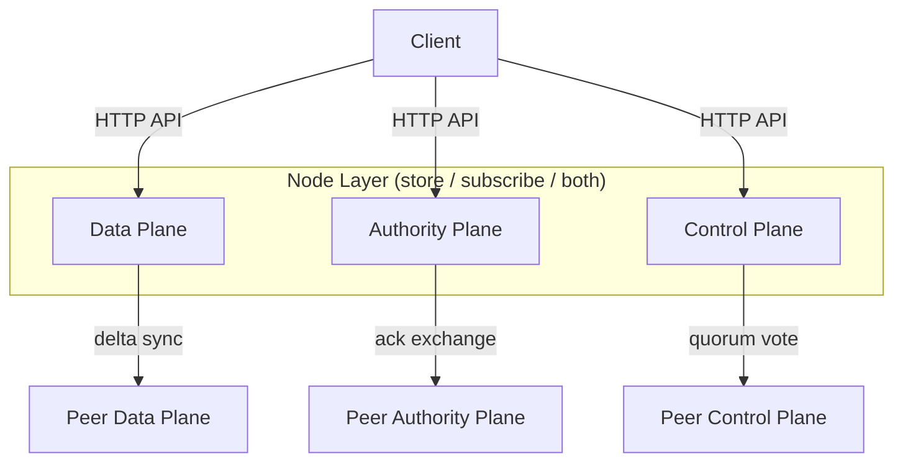
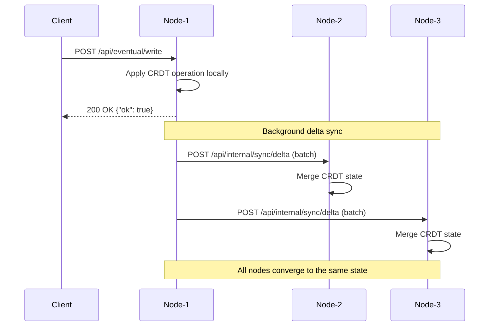
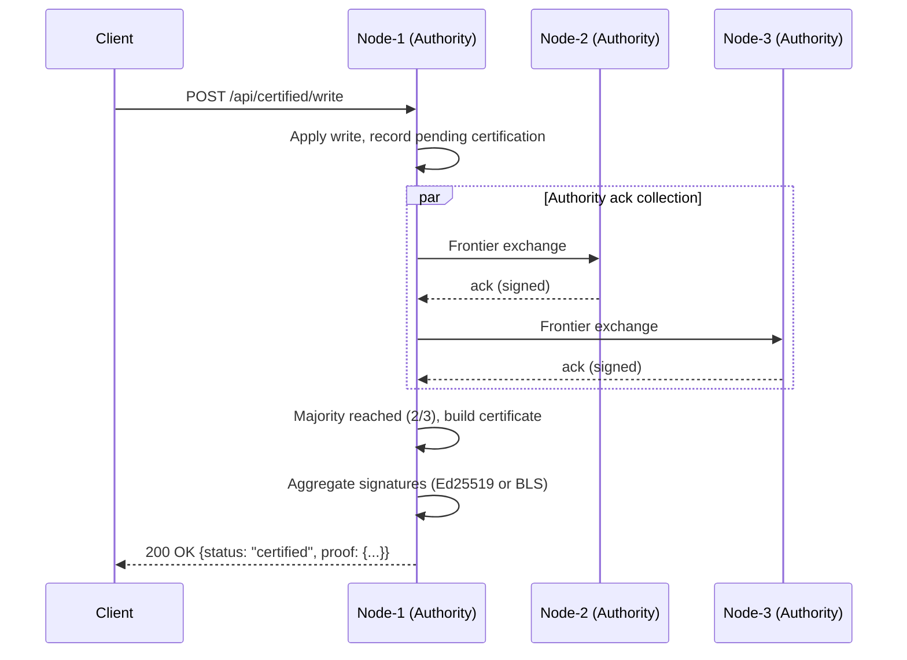
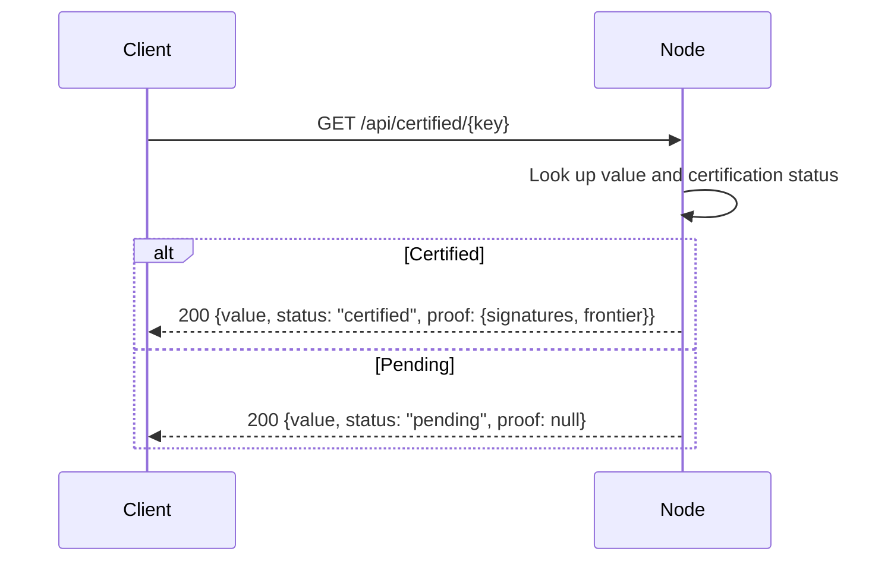
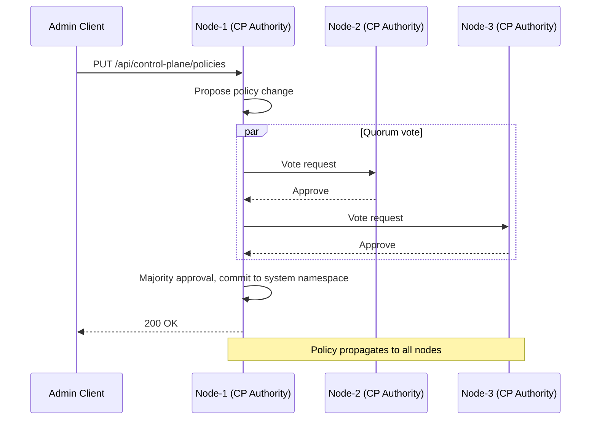
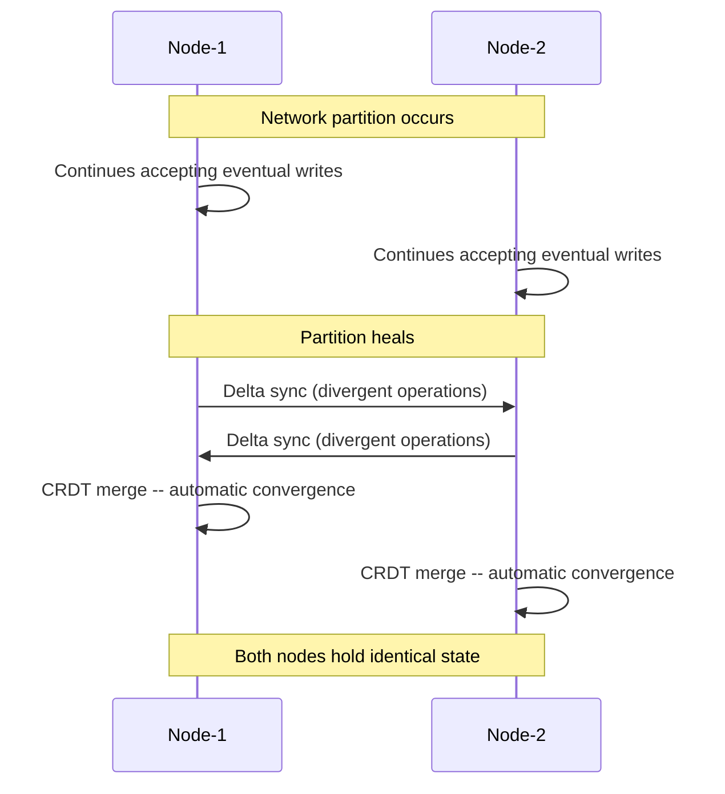

# AsteroidDB アーキテクチャ

本ドキュメントでは、AsteroidDB の内部アーキテクチャについて、コンポーネントの責務、
データフロー、主要な設計判断を説明します。

## コンポーネント概要

AsteroidDB は共通のノードレイヤを共有する 3 つのプレーンで構成されています:



### Data Plane

CRDT ベースのキーバリューデータの保存とレプリケーションを担当します。

| コンポーネント | 場所 | 役割 |
|--------------|------|------|
| CRDT Store | `src/store/` | バージョン管理付き KV ストレージ（PN-Counter, OR-Set, OR-Map, LWW-Register） |
| Delta Sync | `src/network/sync.rs` | バッチ処理と指数バックオフ付き anti-entropy レプリケーション |
| Compaction Engine | `src/compaction/engine.rs` | 圧縮可能な操作ログの削除（majority 確認済みのみ） |
| Adaptive Tuner | `src/compaction/tuner.rs` | 書き込みレートに基づく圧縮頻度の自動調整 |

### Authority Plane

キー範囲に割り当てられた Authority ノードの majority 確認を要求することで、
Certified 整合性を提供します。

| コンポーネント | 場所 | 役割 |
|--------------|------|------|
| Ack Frontier | `src/authority/ack_frontier.rs` | Authority ごとの確認済み更新を HLC ベースの frontier で追跡 |
| Certificate | `src/authority/certificate.rs` | デュアルモード（Ed25519 / BLS）majority certificate の構築 |
| BLS Signatures | `src/authority/bls.rs` | `blst` クレート経由の BLS12-381 aggregate signatures |
| Epoch Manager | `src/authority/certificate.rs` | 24 時間 epoch、7 epoch 猶予期間付き鍵ローテーション |

### Control Plane

system namespace に格納されたクラスタ全体の設定を管理します。

| コンポーネント | 場所 | 役割 |
|--------------|------|------|
| System Namespace | `src/control_plane/system_namespace.rs` | 配置ポリシーと Authority 定義の格納 |
| Consensus | `src/control_plane/consensus.rs` | ポリシー変更に対する quorum ベースの投票 |
| Placement Policy | `src/placement/policy.rs` | タグマッチング、必須/禁止制約、レプリカ数 |
| Latency Model | `src/placement/latency.rs` | レイテンシ考慮配置のためのスライディングウィンドウ RTT 追跡 |
| Topology View | `src/placement/topology.rs` | トポロジー考慮判断のためのリージョン別ノードグルーピング |
| Rebalance | `src/placement/rebalance.rs` | ポリシーまたはメンバーシップ変更時のリバランス計画算出 |

## データフロー

### Eventual Write

Eventual write はローカルで受理され、非同期で伝播します。



主な特性:
- 書き込みはローカル受理後すぐにレスポンスを返却（低レイテンシ）。
- Delta sync は定期的に実行され、失敗時は指数バックオフが適用。
- CRDT マージは可換・結合・冪等であり、順序は問わない。

### Certified Write

Certified write は majority Authority の確認を待ってから確定します。



Certificate 構築の流れ:
1. 書き込みノードが HLC タイムスタンプ付きで更新を記録。
2. Authority ノードが `ack_frontier` の更新を交換。
3. 過半数の Authority が更新のタイムスタンプを超えて frontier を進めると、
   `majority_certificate` が組み立てられる。
4. Ed25519 モードでは個別署名を収集。BLS モードでは単一のコンパクトな
   署名に集約。

### Certified Read



`proof` バンドルには frontier HLC、署名者の公開鍵、署名が含まれ、
クライアントが独立して certificate を検証できます。

### Control Plane ポリシー更新



### パーティション回復



## ノードモード

各ノードは 3 つのモードのいずれかで動作します:

| モード | データ保存 | サブスクリプション受信 | 用途 |
|--------|----------|-------------------|------|
| `store` | あり | なし | プライマリデータノード |
| `subscribe` | なし | あり | 読み取り専用レプリカ、エッジキャッシュ |
| `both` | あり | あり | フル機能ノード（デフォルト） |

## 配置ポリシー

配置の決定は、固定の `Region > DC > Rack` 階層ではなく、タグベースのルールで行います。
これにより、同じポリシーエンジンで地上のマルチ DC デプロイメントと
衛星コンステレーションの両方に対応できます。

ポリシーでは以下を指定します:
- **レプリカ数** -- コピーの最小数。
- **必須タグ** -- 対象となるにはノードがすべての指定タグを持つ必要がある。
- **禁止タグ** -- これらのタグを持つノードは除外。
- **パーティション時の挙動** -- ネットワーク分断時にローカル書き込みを許可するかどうか。
- **Certified 範囲** -- そのキー範囲が Authority certification に参加するかどうか。

ポリシーの例:

```json
{
  "key_range": {"prefix": "telemetry/"},
  "replica_count": 3,
  "required_tags": ["region:us-west"],
  "forbidden_tags": ["decommissioning"],
  "allow_local_write_on_partition": true,
  "certified": false
}
```

## 圧縮 (Compaction)

圧縮エンジンは古い CRDT 操作ログを削除してスペースを回収します。
安全性の不変条件: 過半数の Authority ノードが確認した操作のみ圧縮可能。

- **チェックポイントトリガ**: 30 秒ごと、または 10,000 操作ごと（いずれか早い方）。
- **適応型チューニング**: `WriteRateTracker` が観測された書き込みスループットに基づいて
  圧縮頻度を調整。
- **ダイジェスト検証**: 定期的なキー範囲チェックサムで状態の乖離を検出し、
  不一致時に再検証をトリガ。

## 主要な設計判断

| 判断 | 根拠 |
|------|------|
| CRDT をデフォルトに | 高遅延リンクにおいてパーティション耐性は交渉の余地なし。CRDT は調整なしの自動収束を提供。 |
| Eventual / Certified API の分離 | データベース単位ではなく、操作単位で整合性をアプリケーションが選択可能に。 |
| タグベース配置（階層なし） | 固定の Region > DC > Rack モデルは衛星やアドホックデプロイメントで破綻。タグは厳密にそれより柔軟。 |
| HLC ベースの ack frontier | Hybrid Logical Clock はウォールクロック順序と因果追跡を組み合わせ、クロックスキューや圧縮に耐える。 |
| Ed25519 + BLS デュアルモード | Ed25519 は MVP 向けにシンプルで広くサポートされている。BLS aggregate signatures は Authority セット拡大時に certificate サイズを削減。 |
| System namespace を DB 自身に | 外部調整サービス（例: etcd）が不要。Control plane は自身が管理する同じ合意メカニズムを使用。 |
| Majority のみの合意（MVP） | 構成可能な quorum サイズより単純。クラッシュ故障耐性には十分。Byzantine 耐性は将来対応。 |

## トレードオフ

- **デフォルトでは可用性が強整合性より優先**: Eventual モードは
  パーティション耐性のために線形化可能性を犠牲にする。強い保証が必要な
  アプリケーションは Certified パスを使用する必要があり、レイテンシが増加。
- **Byzantine 障害耐性なし**: MVP はクラッシュ故障のみを想定。悪意のある
  Authority ノードは certificate を偽造可能。BFT は将来フェーズで計画。
- **単一ライター Certified パス**: Certified write は現在 1 ノードが ack を
  収集して開始。真の分散コミットプロトコルはより高い耐障害性を提供するが、
  複雑さも増加。
- **シャーディングなし**: すべてのノードがすべてのキーをレプリケート
  （配置ポリシーでフィルタリング）。真の水平パーティショニングは将来の拡張。
