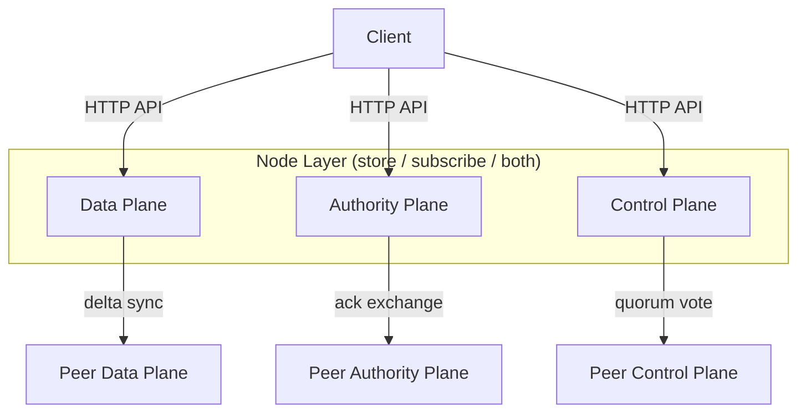
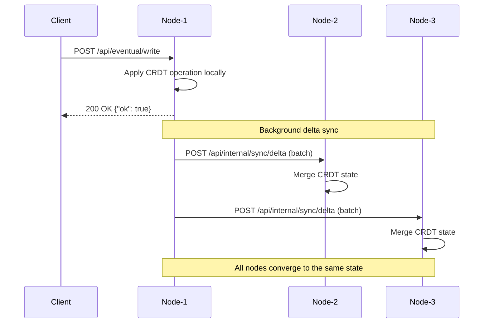
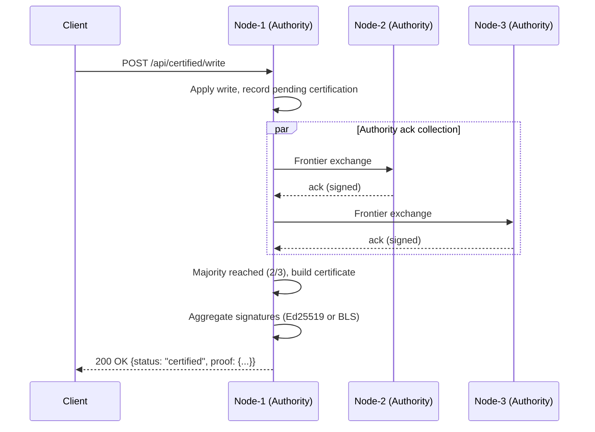
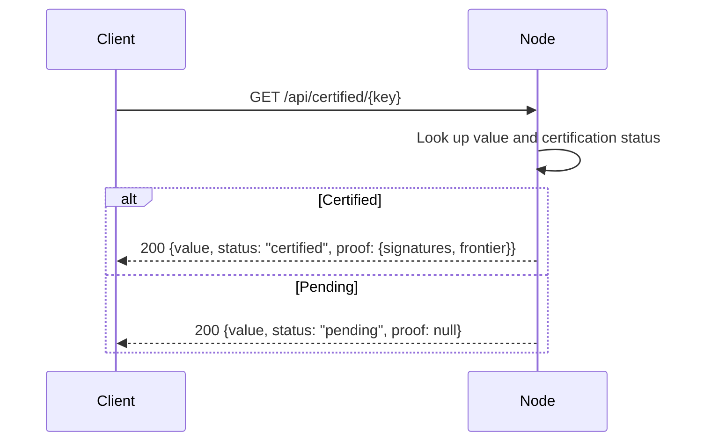
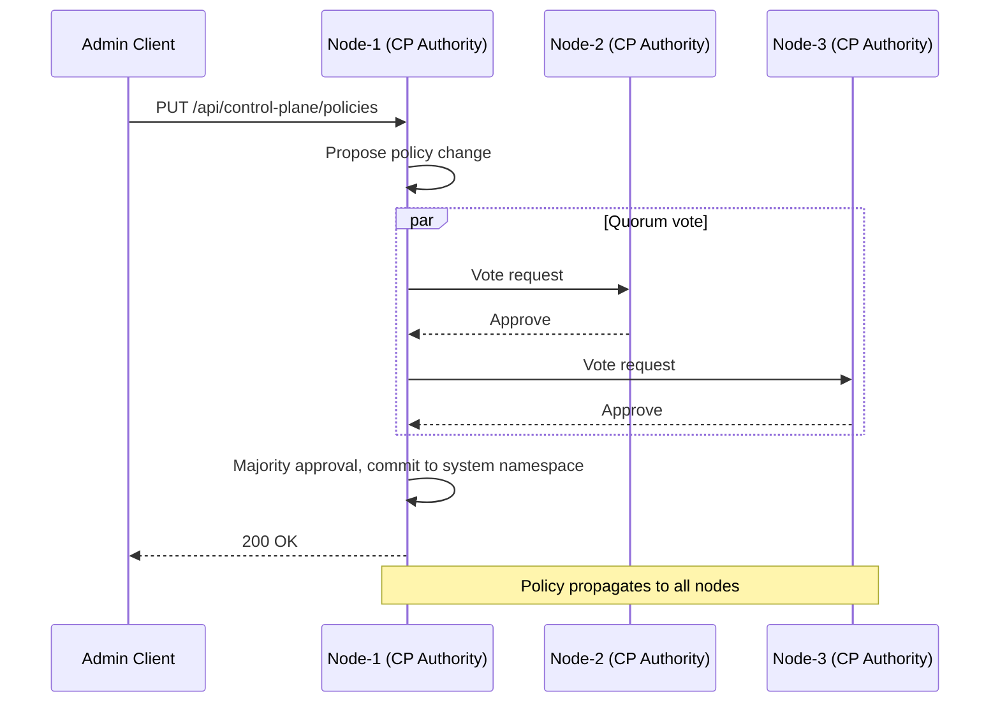
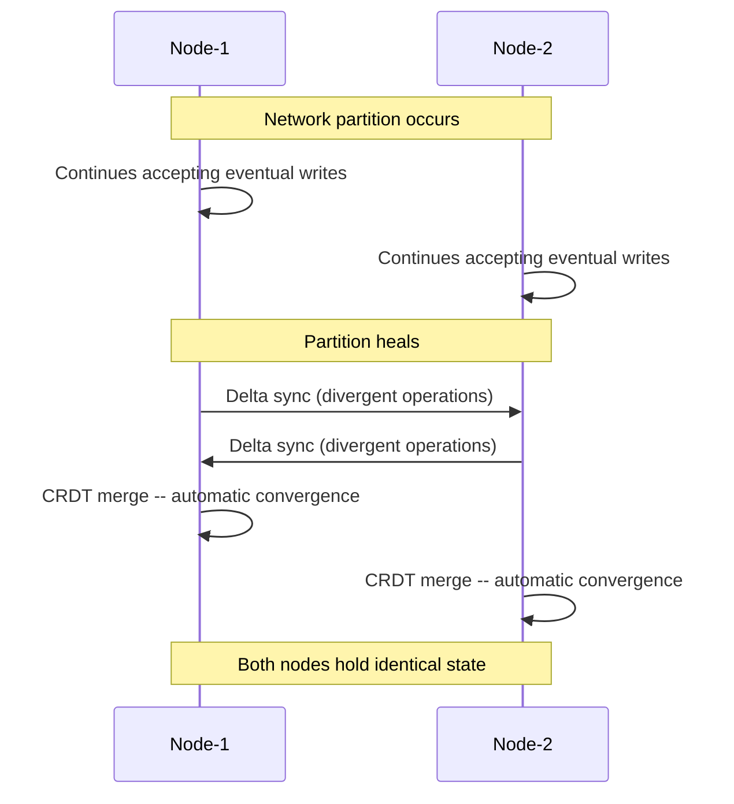

# AsteroidDB Architecture

This document describes the internal architecture of AsteroidDB, including
component responsibilities, data flows, and key design decisions.

## Component Overview

AsteroidDB is structured around three planes that share a common node layer:



### Data Plane

Responsible for storing and replicating CRDT-based key-value data.

| Component | Location | Role |
|-----------|----------|------|
| CRDT Store | `src/store/` | Versioned KV storage with PN-Counter, OR-Set, OR-Map, LWW-Register |
| Delta Sync | `src/network/sync.rs` | Anti-entropy replication with batching and exponential backoff |
| Compaction Engine | `src/compaction/engine.rs` | Removes compactable operation logs (majority-acknowledged only) |
| Adaptive Tuner | `src/compaction/tuner.rs` | Adjusts compaction frequency based on write rate |

### Authority Plane

Provides certified consistency by requiring majority acknowledgment from
authority nodes assigned to a key range.

| Component | Location | Role |
|-----------|----------|------|
| Ack Frontier | `src/authority/ack_frontier.rs` | Tracks HLC-based frontier of acknowledged updates per authority |
| Certificate | `src/authority/certificate.rs` | Dual-mode (Ed25519 / BLS) majority certificate construction |
| BLS Signatures | `src/authority/bls.rs` | BLS12-381 aggregate signatures via the `blst` crate |
| Epoch Manager | `src/authority/certificate.rs` | Key rotation with 24h epochs, 7-epoch grace period |

### Control Plane

Manages cluster-wide configuration stored in the system namespace.

| Component | Location | Role |
|-----------|----------|------|
| System Namespace | `src/control_plane/system_namespace.rs` | Stores placement policies and authority definitions |
| Consensus | `src/control_plane/consensus.rs` | Quorum-based voting for policy mutations |
| Placement Policy | `src/placement/policy.rs` | Tag matching, required/forbidden constraints, replica count |
| Latency Model | `src/placement/latency.rs` | Sliding-window RTT tracking for latency-aware placement |
| Topology View | `src/placement/topology.rs` | Groups nodes by region tags for topology-aware decisions |
| Rebalance | `src/placement/rebalance.rs` | Computes rebalance plans when policy or membership changes |

## Data Flows

### Eventual Write

An eventual write is accepted locally and propagated asynchronously.



Key properties:
- Write returns immediately after local acceptance (low latency).
- Delta sync runs periodically with exponential backoff on failure.
- CRDT merge is commutative, associative, and idempotent -- order does not
  matter.

### Certified Write

A certified write waits for majority authority acknowledgment before
confirming.



Certificate construction:
1. The writing node records the update with an HLC timestamp.
2. Authority nodes exchange `ack_frontier` updates.
3. When a majority of authorities have advanced their frontier past the
   update's timestamp, a `majority_certificate` is assembled.
4. In Ed25519 mode, individual signatures are collected. In BLS mode, they
   are aggregated into a single compact signature.

### Certified Read



The `proof` bundle contains the frontier HLC, signer public keys, and
signatures, allowing the client to independently verify the certificate.

### Control Plane Policy Update



### Partition Recovery



## Node Modes

Each node operates in one of three modes:

| Mode | Stores data | Receives subscriptions | Use case |
|------|-------------|----------------------|----------|
| `store` | Yes | No | Primary data nodes |
| `subscribe` | No | Yes | Read-only replicas, edge caches |
| `both` | Yes | Yes | Full-featured nodes (default) |

## Placement Policy

Placement decisions are made via tag-based rules rather than a fixed
`Region > DC > Rack` hierarchy. This allows the same policy engine to work
for terrestrial multi-DC deployments and satellite constellations.

A policy specifies:
- **Replica count** -- minimum number of copies.
- **Required tags** -- nodes must have all specified tags to be eligible.
- **Forbidden tags** -- nodes with any of these tags are excluded.
- **Partition behavior** -- whether local writes are allowed during a
  network split.
- **Certified range** -- whether the key range participates in authority
  certification.

Example policy:

```json
{
  "key_range": {"prefix": "telemetry/"},
  "replica_count": 3,
  "required_tags": ["region:us-west"],
  "forbidden_tags": ["decommissioning"],
  "allow_local_write_on_partition": true,
  "certified": false
}
```

## Compaction

The compaction engine removes stale CRDT operation logs to reclaim space.
Safety invariant: only operations acknowledged by a majority of authority
nodes may be compacted.

- **Checkpoint trigger**: every 30 seconds or 10,000 operations (whichever
  comes first).
- **Adaptive tuning**: the `WriteRateTracker` adjusts compaction frequency
  based on observed write throughput.
- **Digest verification**: periodic key-range checksums detect state
  divergence, triggering re-verification on mismatch.

## Key Design Decisions

| Decision | Rationale |
|----------|-----------|
| CRDT as the default | Partition tolerance is non-negotiable for high-latency links; CRDTs provide automatic convergence without coordination. |
| Separate eventual / certified APIs | Lets applications choose consistency per operation instead of per database. |
| Tag-based placement (no hierarchy) | A fixed Region > DC > Rack model breaks in satellite or ad-hoc deployments. Tags are strictly more flexible. |
| HLC-based ack frontier | Hybrid Logical Clocks combine wall-clock ordering with causality tracking, surviving clock skew and compaction. |
| Ed25519 + BLS dual mode | Ed25519 is simple and well-supported for MVP. BLS aggregate signatures reduce certificate size as the authority set grows. |
| System namespace in the DB itself | Avoids an external coordination service (e.g., etcd). The control plane uses the same consensus mechanism it manages. |
| Majority-only consensus (MVP) | Simpler than configurable quorum sizes. Sufficient for crash-fault tolerance. Byzantine tolerance is deferred. |

## Trade-offs

- **Availability over strong consistency by default**: Eventual mode
  sacrifices linearizability for partition tolerance. Applications needing
  strong guarantees must use the certified path, which adds latency.
- **No Byzantine fault tolerance**: The MVP assumes crash faults only. A
  malicious authority node can forge certificates. BFT is planned for a
  future phase.
- **Single-writer certified path**: Certified writes are currently initiated
  by one node that collects acks. A true distributed commit protocol would
  add more resilience but also more complexity.
- **No sharding**: All nodes replicate all keys (filtered by placement
  policy). True horizontal partitioning is a future extension.
